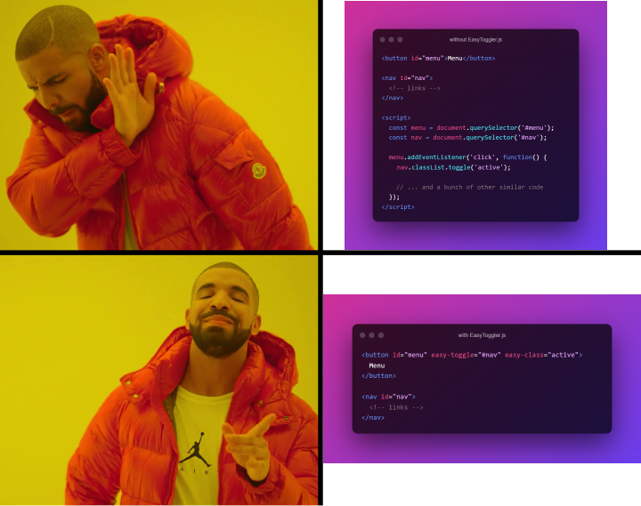

# EasyToggler.js 🔗🚀


[](https://www.jsdelivr.com/package/npm/easy-toggler)


Simple class switcher on web elements. JavaScript only.



## Use a plugin instead of JavaScript
```html
<!-- instead of js: menu.classList.toggle('active') -->
<button easy-toggle="#target" easy-class="active">Toggle class</button>

<!-- instead of js: menu.classList.add('active') -->
<button easy-add="#target" easy-class="active">Add class</button>

<!-- instead of js: menu.classList.remove('active') -->
<button easy-remove="#target" easy-class="active">Remove class</button>

<!-- instead of js: menu.classList.toggle('active') + work with e.closest() -->
<button easy-toggle="#target" easy-class="active" easy-rcoe>Removing a class if we click on an empty space</button>
```

## Import EasyToggler
### ES
```html
<script type="module">
  import easySetup from "easy-toggler";

  easySetup({
    // html attrs
    toggle: 'easy-toggle',
    add: 'easy-add',
    remove: 'easy-remove',
    class: 'easy-class',
    rcoe: 'easy-rcoe',
    parallel: 'easy-parallel',
    self: 'easy-self',
    selfRcoe: 'easy-self-rcoe',

    // Hooks
    onToggle($el){},
    onAdd($el){},
    onRemove($el){},
    onRcoe($el){},
  });
</script>
```
or easier:
```html
<script type="module">
  import easySetup from "easy-toggler";
  easySetup();
</script>
```

### CDN jsDelivr (iife)
```html
<script src="https://cdn.jsdelivr.net/npm/easy-toggler@2.2.7"></script>
```
### CJS
```html
<script type="module">
  const easySetup = require("easy-toggler");

  easySetup({
    // html attrs
    toggle: 'easy-toggle',
    add: 'easy-add',
    remove: 'easy-remove',
    class: 'easy-class',
    rcoe: 'easy-rcoe',
    parallel: 'easy-parallel',
    self: 'easy-self',
    selfRcoe: 'easy-self-rcoe',

    // Hooks
    onToggle($el){},
    onAdd($el){},
    onRemove($el){},
    onRcoe($el){},
  });
</script>
```
or easier:
```html
<script type="module">
  const easySetup = require("easy-toggler");
  easySetup();
</script>
```

## Demo
Visit demo page: [rah-emil.ru/easy-toggler](https://rah-emil.ru/easy-toggler)

### Example №1
When you click the button, the class ```show``` will be added to ```<nav id="main_menu">```
```html
<button easy-toggle="#main_menu" easy-class="show">Menu</button>

<nav id="main_menu">
    <ul>
        <li><a>Home</a></li>
        <li><a>About us</a></li>
        <li><a>Services</a></li>
        <li><a>Portfolio</a></li>
        <li><a>Contact us</a></li>
    </ul>
</nav>
```

### Example №2
When you click the button, the class  ```open``` will be added to ```<div id="categories" class="dropdown-menu">```. When clicking outside the element area, class ```open``` will be deleted from ```<div id="categories" class="dropdown-menu">```, since we specified the  ```easy-rcoe``` attribute for the link.
```html
<div class="dropdown">
    <a href="#" easy-toggle="#categories" easy-class="open" easy-rcoe>Categories</a>

    <div id="categories" class="dropdown-menu">
        <a href="#">HTML</a>
        <a href="#">CSS</a>
        <a href="#">JavaScript</a>
        <a href="#">Vue.js</a>
        <a href="#">Laravel</a>
    </div>
</div>
```

**EasyToggler.js** only allows you to conveniently manage the element classes. CSS styles (behavior of elements with certain classes) must be specified independently.

## Attributes
- **easy-toggle** - toggle class for target element
- **easy-add** - add class for target element
- **easy-remove** - remove class for target element
- **easy-class** - specifying the class for the target element
- **easy-rcoe** - indicate whether it is necessary to delete the class if another is pressed
- **easy-parallel** - so that elements can open parallel to each other
- **easy-self** - add a class to the clicked button
- **easy-self-rcoe** - indicate whether it is necessary to delete the class if another is pressed (for self elements)


## Hooks
- **onToggle($el)** - hook after action toggle
- **onAdd($el)** - hook after action add
- **onRemove($el)** - hook after action remove
- **onRcoe($el)** - hook after action rcoe
